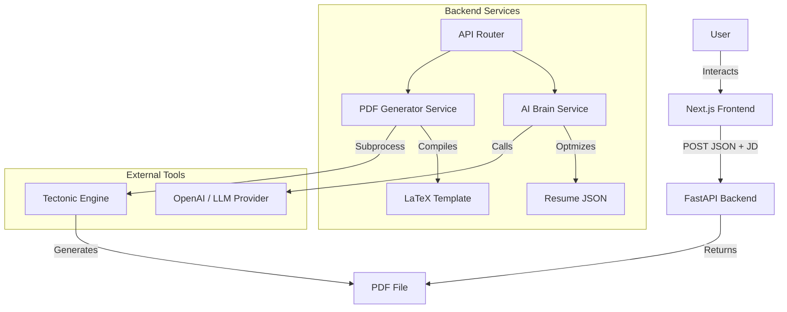

# System Architecture

## Overview

Tailored-Resume follows a client-server architecture where a Next.js frontend interacts with a FastAPI backend. The key differentiator is the stateless PDF generation pipeline, where data is passed from Client -> Backend -> AI -> LaTeX -> PDF without complex database state management for the artifacts themselves.

## High-Level Architecture

## Component Description

### 1. Frontend (`/frontend`)

- **Framework**: Next.js 14+ (App Router).
- **State Management**: React `useState` for handling the large JSON object.
- **UI Components**: Shadcn/UI for a clean, accessible interface.
- **Responsibility**:
  - Validate JSON input.
  - Capture Job Description.
  - Display AI-tailored results before PDF generation.

### 2. Backend (`/backend`)

- **Framework**: FastAPI.
- **Concurrency**: Asyncio for handling non-blocking LLM calls and subprocess management.
- **Virtual Environment**: Isolated dependencies in `venv`.

### 3. Shared Schema (`/shared`)

- **Single Source of Truth**: The `schema.json` defines the strict structure of the Resume.
- **Validation**: Both Frontend (conceptually) and Backend (via Pydantic) respect this structure.

### 4. Templates (`/templates`)

- **Engine**: Jinja2.
- **Format**: LaTeX (`.tex`).
- **Logic**: The template contains loops (``) to dynamically render content based on the data provided.

## Data Flow

1. **Input**: User provides `Master Resume JSON` + `Job Description`.
2. **Tailoring**:
   - Backend receives inputs.
   - `AI Brain` analyzes JD keywords.
   - `AI Brain` filters `projects` and rewrites `highlights` in the JSON.
   - **Output**: `Tailored Resume JSON`.
3. **Generation**:
   - User reviews `Tailored Resume JSON`.
   - User clicks "Generate".
   - `PDF Service` injects JSON into `resume.tex`.
   - `Tectonic` compiles `.tex` to `.pdf`.
   - **Output**: Binary PDF stream.
